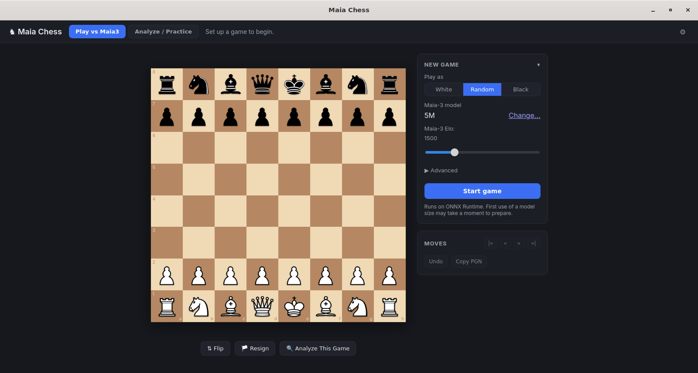

# maia chess

Desktop chess app (Tauri + Rust) for playing against [Maia-3](https://github.com/CSSLab/maia3) (CSSLab), a model trained to predict human moves at a chosen Elo.



## features

- play vs Maia-3: pick side, Elo (1100–2900, adjustable mid-game), temperature/top-p, custom FEN
- analyze: paste/send a PGN, Stockfish grades every move (good/inaccuracy/mistake/blunder)
- practice: flagged mistakes become puzzles — solve, reveal, or step through the line

## setup (first run)

No bundled weights. Gear icon → setup screen:
- export a HF checkpoint to ONNX (one-time, handled in-app), or use the legacy `maia3` pip package on `PATH`
- Stockfish auto-downloads if not on `PATH`

## stack

- `src/` — plain HTML/CSS/JS, no build step, no npm
- `src-tauri/src/` — Rust + Tauri v2: `game.rs` (moves/FEN), `engine.rs` (UCI), `analysis.rs` (grading/puzzles), `pgn.rs`, `setup.rs`

## prerequisites

- Rust (stable) + Tauri CLI: `cargo install tauri-cli`
- Python 3 (ONNX export or `maia3` pip path)
- `flatpak-builder` (for the Flatpak build)

## run

```sh
cargo tauri dev
```

## build

```sh
flatpak-builder --user --install --force-clean build-dir dev.maiachess.MaiaChess.yml
```

Plain `cargo build --release`, no Tauri bundler — installs binary + `.desktop` + metainfo by hand. CI runs this on tag push. `cargo tauri build` works too, for a local AppImage/deb.

