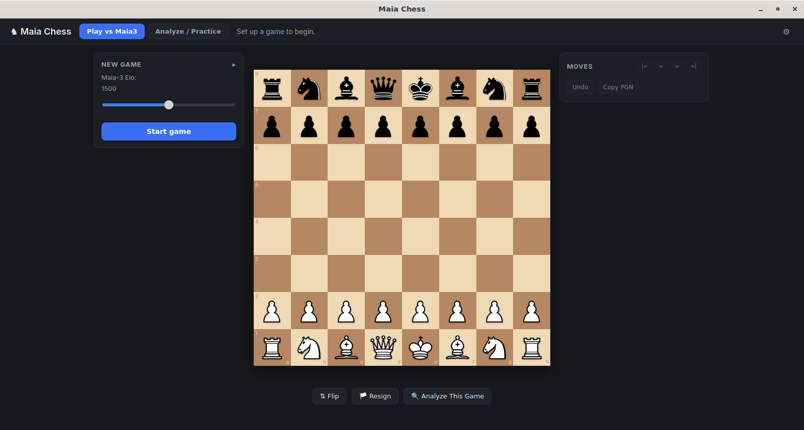

# maia chess

Chess app (Tauri v2 + Rust) for playing [Maia-3](https://github.com/CSSLab/maia3) at a chosen Elo. Desktop + Android, fully self-contained.



## features

- **play** vs Maia-3: side, Elo 500–2500 (changeable mid-game), temperature/top-p, custom FEN
- **analyze** a PGN: Stockfish grades every move; "Engine" toggle for live eval
- **practice**: mistakes become puzzles

## prerequisites

- Rust stable + `cargo install tauri-cli`
- Python 3 (only for `scripts/fetch_assets.py`)
- `gh` logged in (the models come from the `models` release)
- `flatpak-builder` (Flatpak only)
- Windows: VS Build Tools, C++ workload

## run

Everything is bundled, so there is no setup screen and nothing is downloaded at runtime. Fetch the assets once, then run:

```sh
python3 scripts/fetch_assets.py            # ONNX Runtime, Stockfish, maia3-23m
python3 scripts/fetch_assets.py --models maia3-5m maia3-23m   # pick other models
cargo tauri dev
```

The fetch script fills `src-tauri/resources/models/`, `src-tauri/resources/ort/` and `src-tauri/resources/stockfish/` (all gitignored). `ORT_DYLIB_PATH` overrides the bundled ONNX Runtime and `STOCKFISH_PATH` the bundled Stockfish; `STOCKFISH_TAG` pins a release (default: latest).

Stockfish is the official release binary, spawned as a child process and driven over plain UCI. Windows and Linux only; Android loads Stockfish in-process (see below).

## build

CI does the compiling: run **Models** once, then **Windows** or **Flatpak** (both take a `models` input). Locally:

```sh
python3 scripts/fetch_assets.py
cargo tauri build --bundles nsis   # windows installer
cargo tauri build                  # local appimage/deb
```

## android

arm64 only. Stockfish, ONNX Runtime and the models are packed into the APK; nothing is downloaded or extracted at runtime. Stockfish 19 (small embedded NNUE, from [dart-multistockfish](https://github.com/lichess-org/dart-multistockfish)) and ONNX Runtime load in-process from `lib/`; the models are read straight out of the APK's `assets/models/`.

**CI** (GitHub Actions):
1. run **Models** once (exports + publishes `.onnx` to the `models` release)
2. run **Android** (`models` input, default `maia3-5m`) → artifact `maia-chess-android`
3. optional signing secrets: `ANDROID_KEYSTORE_BASE64`, `ANDROID_KEYSTORE_PASSWORD`, `ANDROID_KEY_ALIAS` (else a throwaway key; can't update across keys)

**local** (Android Studio, `NDK_HOME` set, `rustup target add aarch64-linux-android`):

```sh
cargo tauri android init
# git clone https://github.com/lichess-org/dart-multistockfish, then build its light flavor with the NDK:
#   cmake -S dart-multistockfish/pkgs/multistockfish_light/android -B sf-build \
#     -DCMAKE_TOOLCHAIN_FILE=$NDK_HOME/build/cmake/android.toolchain.cmake \
#     -DANDROID_ABI=arm64-v8a -DANDROID_PLATFORM=android-24 -DCMAKE_BUILD_TYPE=Release
#   cmake --build sf-build --parallel
# take jni/arm64-v8a/libonnxruntime.so from the onnxruntime-android AAR
python3 scripts/patch_android.py sf-build/libmultistockfish_light.so arm64-v8a \
  --ort path/to/libonnxruntime.so --model path/to/maia3-5m.onnx
cargo tauri android build --apk --target aarch64   # or: cargo tauri android dev
```

`patch_android.py` also keeps `.onnx` assets uncompressed (`noCompress`) and installs the launcher icon from `src-tauri/icons/android/`, generated from `icon.png` (same as the Flatpak). Regenerate with `python3 scripts/gen_android_icons.py` (needs Pillow).

## layout

- `src/` — plain HTML/CSS/JS, no build step
- `src-tauri/src/` — `game.rs`, `engine.rs` (UCI), `analysis.rs`, `pgn.rs`, `bundled.rs` (models, ONNX Runtime, Stockfish), `process_stockfish.rs`
- `src-tauri/maia-core/` — Rust port of the Maia UCI engine (ONNX via `ort`); standalone: `cargo run --release -p maia-core --bin maia-uci -- --onnx maia3-5m.onnx`

## credits

Move classification adapted from [WintrChess](https://github.com/WintrCat/wintrchess); human insights from [maia-platform-frontend](https://github.com/CSSLab/maia-platform-frontend) (both GPL-3.0). Models by [CSSLab](https://github.com/CSSLab/maia3).
